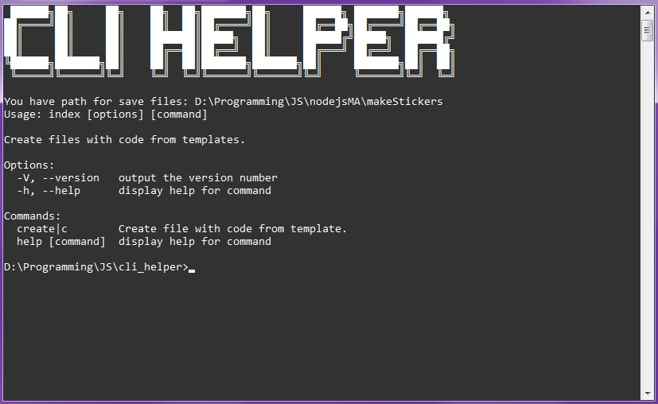

# cli_helper   

Designed specifically for a single closed project to speed up development in the Python programming language.   
This CLI program create new python file with some default code from python template files.   
Template file selected by interaction with the user through questions in command line(terminal).   

Build on JavaScript(Node.js) and use libraries:   
- console-clear   
- figlet  
- figures    
- chalk   
- commander   
- inquirer   

run.bat - create link for simple run this program from terminal by typed "helper" in terminal. This file run only in Windows os.   
   
